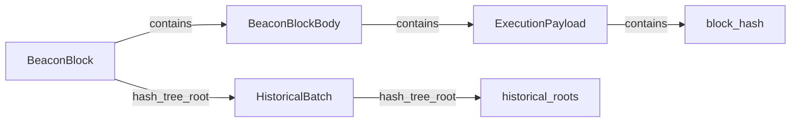
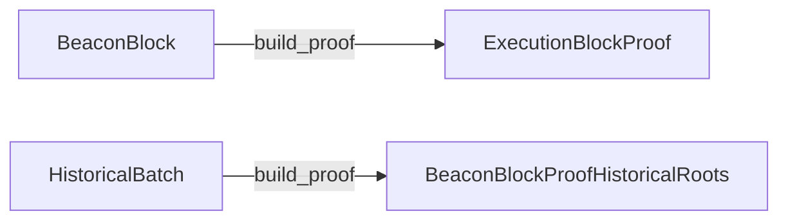
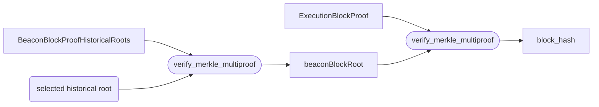
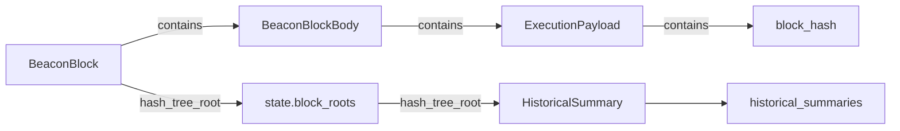
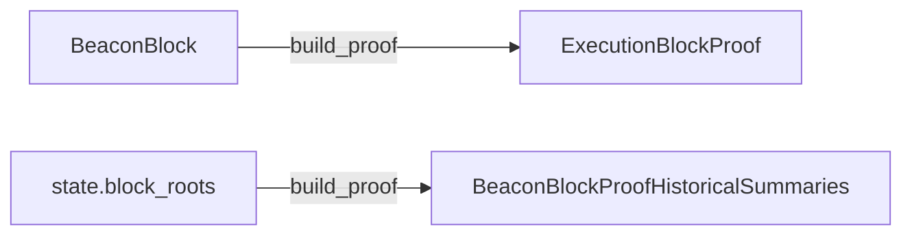
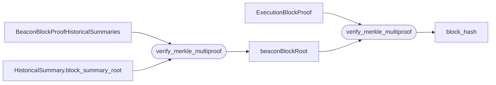

# Execution Chain History Network

This document is the specification for the sub-protocol that supports on-demand availability of Ethereum execution chain history data.

## Overview

The chain history network is a [Kademlia](https://pdos.csail.mit.edu/~petar/papers/maymounkov-kademlia-lncs.pdf) DHT that uses the [Portal Wire Protocol](../portal-wire-protocol.md) to establish an overlay network on top of the [Discovery v5](https://github.com/ethereum/devp2p/blob/master/discv5/discv5-wire.md) protocol.

Execution chain history data consists of historical block headers, block bodies (transactions, ommers and withdrawals) and block receipts.

In addition, the chain history network provides block number to historical block header lookups.

### Data

#### Types

- Block headers
- Block bodies
    - Transactions
    - Ommers
    - Withdrawals
- Receipts

#### Retrieval

The network supports the following mechanisms for data retrieval:

- Block header by block header hash
- Block header by block number
- Block body by block header hash
- Block receipts by block header hash

> This sub-protocol does **not** support retrieval of transactions by hash, only the full set of transactions for a given block. See the "Canonical Transaction Index" sub-protocol of the Portal Network for more information on how the portal network implements lookup of transactions by their individual hashes.

## Specification

### Distance Function

The history network uses the stock XOR distance metric defined in the portal wire protocol specification.

### Content ID Derivation Function

The history network uses the SHA256 Content ID derivation function from the portal wire protocol specification.

### Wire Protocol

The [Portal wire protocol](../portal-wire-protocol.md) is used as wire protocol for the history network.

#### Protocol Identifier

As specified in the [Protocol identifiers](../portal-wire-protocol.md#protocol-identifiers) section of the Portal wire protocol, the `protocol` field in the `TALKREQ` message **MUST** contain the value of `0x500B`.

#### Supported Message Types

The history network supports the following protocol messages:

- `Ping` - `Pong`
- `FindNodes` - `Nodes`
- `FindContent` - `FoundContent`
- `Offer` - `Accept`

#### `Ping.payload` & `Pong.payload`

In the history network the `payload` field of the `Ping` and `Pong` messages. The first packet between another client MUST be [Type 0: Client Info, Radius, and Capabilities Payload](../ping-extensions/extensions/type-0.md). Then upgraded to the latest payload supported by both of the clients.

List of currently supported payloads, by latest to oldest.
-  [Type 2 History Radius Payload](../ping-extensions/extensions/type-2.md)


### Routing Table

The history network uses the standard routing table structure from the Portal Wire Protocol.

### Node State

#### Data Radius

The history network includes one additional piece of node state that should be tracked. Nodes must track the `data_radius` from the Ping and Pong messages for other nodes in the network. This value is a 256 bit integer and represents the data that a node is "interested" in. We define the following function to determine whether node in the network should be interested in a piece of content.

```python
interested(node, content) = distance(node.id, content.id) <= node.data_radius
```

A node is expected to maintain `radius` information for each node in its local node table. A node's `radius` value may fluctuate as the contents of its local key-value store change.

A node should track their own radius value and provide this value in all Ping or Pong messages it sends to other nodes.

### Data Types

#### Constants

We define the following constants which are used in the various data type definitions.

```python
MAX_TRANSACTION_LENGTH = 2**24  # ~= 16 million
# Maximum transaction body length is achieved by filling calldata with 0's
# until the block limit of (currently) 30M gas is reached.
# At a gas cost of 4 per 0-byte, that produces a 7.5MB transaction. We roughly
# double that size to a maximum of >16 million for some headroom. Note that
# EIP-4488 would put a roughly 1MB limit on transaction length, effectively. So
# increases are not planned (instead, the opposite).

MAX_TRANSACTION_COUNT = 2**14  # ~= 16k
# 2**14 simple transactions would use up >340 million gas at 21k gas each.
# Current gas limit tops out at 30 million gas.

MAX_RECEIPT_LENGTH = 2**27  # ~= 134 million
# Maximum receipt length is logging a bunch of data out, currently at a cost of
# 8 gas per byte. Since that is double the cost of 0 calldata bytes, the
# maximum size is roughly half that of the transaction: 3.75 million bytes.
# But there is more reason for protocol devs to constrain the transaction length,
# and it's not clear what the practical limits for receipts are, so we should add more buffer room.
# Imagine the cost drops by 2x and the block gas limit goes up by 8x. So we add 2**4 = 16x buffer.

MAX_HEADER_LENGTH = 2**11  # = 2048
# Maximum header length is fairly stable at about 500 bytes. It might change at
# the merge, and beyond. Since the length is relatively small, and the future
# of the format is unclear to me, I'm leaving more room for expansion, and
# setting the max at about 2 kilobytes.

MAX_ENCODED_UNCLES_LENGTH = MAX_HEADER_LENGTH * 2**4  # = 2**15 ~= 32k
# Maximum number of uncles is currently 2. Using 16 leaves some room for the
# protocol to increase the number of uncles.

MAX_WITHDRAWAL_COUNT = 16
# Number sourced from consensus specs
# https://github.com/ethereum/consensus-specs/blob/f7352d18cfb91c58b1addb4ea509aedd6e32165c/presets/mainnet/capella.yaml#L12
# MAX_WITHDRAWAL_COUNT = MAX_WITHDRAWALS_PER_PAYLOAD

WITHDRAWAL_LENGTH = 64
# Withdrawal: index (u64), validator_index (u64), address, amount (u64)
#   - 8 + 8 + 20 + 8 = 44 bytes
#   - allow extra space for rlp encoding overhead

SHANGHAI_TIMESTAMP = 1681338455
# Number sourced from EIP-4895

MAX_EPHEMERAL_HEADER_PAYLOAD = 256
# The maximum number of ephemeral headers that can be requested or transferred
# in a single request.

MAX_HEADER_PROOF_LENGTH = 1024
# Maximum length for header proof. This maximum works for the current 3 types of proof.
```

#### Encoding Content Values for Validation

The encoding choices generally favor easy verification of the data, minimizing decoding. For
example:

- `keccak(encoded_uncles) == header.uncles_hash`
- Each `encoded_transaction` can be inserted into a trie to compare to the
  `header.transactions_root`
- Each `encoded_receipt` can be inserted into a trie to compare to the `header.receipts_root`

Combining all of the block body in RLP, in contrast, would require that a validator loop through
each receipt/transaction and re-rlp-encode it, but only if it is a legacy transaction.

#### Block Header

```python
# Content types

# Proof for EL BlockHeader before TheMerge / Paris
BlockProofHistoricalHashesAccumulator = Vector[Bytes32, 15]

# Proof that EL block_hash is in BeaconBlock -> BeaconBlockBody -> ExecutionPayload
ExecutionBlockProof = Vector[Bytes32, 11]

# Proof that BeaconBlock root is part of historical_roots and thus canonical
# From TheMerge until Capella -> Bellatrix fork.
BeaconBlockProofHistoricalRoots = Vector[Bytes32, 14]

# Proof for EL BlockHeader from TheMerge until Capella
BlockProofHistoricalRoots = Container[
    beaconBlockProof: BeaconBlockProofHistoricalRoots, # Proof that the BeaconBlock is part of the historical_roots and thus part of the canonical chain
    beaconBlockRoot: Bytes32, # hash_tree_root of BeaconBlock used to verify the proofs
    executionBlockProof: ExecutionBlockProof, # Proof that EL BlockHash is part of the BeaconBlock
    slot: Slot # Slot of BeaconBlock, used to calculate the historical_roots index
]

# Proof that EL block_hash is in BeaconBlock -> BeaconBlockBody -> ExecutionPayload
ExecutionBlockProofCapella = List[Bytes32, limit=12]

# Proof that BeaconBlock root is part of historical_summaries and thus canonical
# For Capella and onwards
BeaconBlockProofHistoricalSummaries = Vector[Bytes32, 13]

# Proof for EL BlockHeader for Capella and onwards
BlockProofHistoricalSummaries = Container[
    beaconBlockProof: BeaconBlockProofHistoricalSummaries, # Proof that the BeaconBlock is part of the historical_summaries and thus part of the canonical chain
    beaconBlockRoot: Bytes32, # hash_tree_root of BeaconBlock used to verify the proofs
    executionBlockProof: ExecutionBlockProofCapella, # Proof that EL BlockHash is part of the BeaconBlock
    slot: Slot # Slot of BeaconBlock, used to calculate the historical_summaries index
]

BlockHeaderWithProof = Container(
  header: ByteList[MAX_HEADER_LENGTH], # RLP encoded header in SSZ ByteList
  proof: ByteList[MAX_HEADER_PROOF_LENGTH], # SSZ encoded proof
)
```

The `BlockHeaderWithProof` contains the RLP encoded block header and an SSZ encoded proof for that header. The proof MUST be of the type `BlockProofHistoricalHashesAccumulator` `BlockProofHistoricalRoots`, `BlockProofHistoricalSummaries` depending on the hardfork, see the definitions above. The block header `timestamp` field can be used to select to which type to decode the proof.

* For pre-merge headers, clients SHOULD only accept headers with `BlockProofHistoricalHashesAccumulator` proofs.
* For post-merge until Capella headers, clients SHOULD only accept headers with `BlockProofHistoricalRoots` proofs.
* For Capella and onwards headers, clients SHOULD only accept headers with `BlockProofHistoricalSummaries` proofs.
* For headers that are not yet part of the last period, clients SHOULD accept offers for these headers if the client can prove that the headers are a valid child of the HEAD `block_hash` provided by their external oracle. See *Ephemeral Block Headers* for how to handle headers from the last period.

##### Block Header by Hash

```python
# Content and content key

block_header_key = Container(block_hash: Bytes32)
selector         = 0x00

block_header_with_proof = BlockHeaderWithProof(header: rlp.encode(header), proof: proof)

content          = SSZ.serialize(block_header_with_proof)
content_key      = selector + SSZ.serialize(block_header_key)
```

##### Block Header by Number


```python
# Content and content key

block_number_key = Container(block_number: uint64)
selector         = 0x03

block_header_with_proof = BlockHeaderWithProof(header: rlp.encode(header), proof: proof)

content          = SSZ.serialize(block_header_with_proof)
content_key      = selector + SSZ.serialize(block_number_key)
```

#### Ephemeral Block Headers

This content type represents block headers *near* the HEAD of the chain. They are provable by tracing through the chain of `header.parent_hash` values. All nodes in the network are assumed to store some amount of this content. The `Ping.custom_data` and `Pong.custom_data` fields can be used to learn the number of recent headers that a client makes available. It is recommended that clients store the full window of 8192 blocks of this data. The nodes radius isn't used for ephemeral block headers.

> Note: The history network does not provide a mechanism for knowing the HEAD of the chain. Clients to this network **MUST** use an external oracle for this information. The Portal Beacon Network is able to provide this information.

> Note: The content-id for this data type is not meaningful.

> Note: Clients **SHOULD** avoid requesting missing headers from the last 64 block non-finalized window if their external oracle has updated the tip of the chain in a way that invalidates previously valid headers, as it is expected that valid updates are already being propagated to fill this discrepancy. Since all other Portal clients relying on the Portal Beacon Network would have the same view of the network, if implementations did try to find this content, it would end up being a DOS vector.

> Note: When the external oracle updates the tip of the chain causing previously valid headers to be invalidated, the client **SHOULD** not prune any non-finalized ephemeral headers until the node can rebuild a valid chain from latest finalized header to the HEAD of the chain.

> Note: Clients **SHOULD** implement a mechanism to purge headers older than 8192 blocks from their content databases.

##### Ephemeral Headers by `FindContent`

```python
# Content and content key

find_content_ephemeral_headers_key = Container(block_hash: Bytes32, ancestor_count: uint8)
selector                 = 0x04

BlockHeader              = ByteList[MAX_HEADER_LENGTH]
ephemeral_header_payload = List(BlockHeader, limit=MAX_EPHEMERAL_HEADER_PAYLOAD)

content                  = SSZ.serialize(ephemeral_header_payload)
content_key              = selector + SSZ.serialize(find_content_ephemeral_headers_key)
```

The `find_content_ephemeral_headers_key` encodes a request for headers anchored to the block
hash indicated by `find_content_ephemeral_headers_key.block_hash`. The
`find_content_ephemeral_headers_key.ancestor_count` **MUST** be in the inclusive range
0-255.

The `ephemeral_header_payload` is an SSZ list of RLP encoded block header
objects. This object is subject to the following validity conditions.

* This content type **MUST** only be used for `FindContent` requests
* The list **MAY** be empty which signals that the responding node was unable to fulfill the request.
* The first element in the list **MUST** be the RLP encoded block header indicated by the `find_content_ephemeral_headers_key.block_hash` field from the content key.
* Each element after the first element in the list **MUST** be the RLP encoded block header indicated by the `header.parent_hash` of the previous item from the list.
* The list **SHOULD** contain no more than `find_content_ephemeral_headers_key.ancestor_count + 1` items.

##### Ephemeral Header by `Offer`

```python
# Content and content key

offer_ephemeral_header_key = Container(block_hash: Bytes32)
selector                 = 0x05

OfferEphemeralHeader = Container(
  header: ByteList[MAX_HEADER_LENGTH], # RLP encoded header in SSZ ByteList
)
offer_ephemeral_header = OfferEphemeralHeader(header: rlp.encode(header))

content          = SSZ.serialize(offer_ephemeral_header)
content_key      = selector + SSZ.serialize(offer_ephemeral_header_key)
```

* This content type **MUST** only be used for `Offer` requests

###### Ephemeral Header Offer Logic

Ephemeral block headers are seeded into the network through bridges. Since ephemeral block headers are at the head of the chain, bridges should monitor if re-orgs occur. 

An `Offer` message containing ephemeral headers **MUST**
* Only contain content keys for ephemeral headers
* Ephemeral header content keys offered to the client **MUST** be in a strictly consecutive ascending order by `block_number`
* An `Offer` message can only contain up to 31 ephemeral header content keys
* Contain content keys from the latest tip as specified by `LightClientUpdates` to the common ancestor block if a re-org occurred. So normally this would be 1 header, unless a re-org occurred where multiple would be included. An additional `8` header's content keys, should be included in the `Offer` message as padding.
* If bridges detect a re-org depth is larger then 31 content keys, additional `Offer` messages containing the rest of the chain should be sent by the bridge in 10 second intervals of the initial `Offer` message

Details for clients
* When offered ephemeral headers, clients should scan the content keys for a `block_hash` anchored via the external oracle. All headers preceding the anchored header in the content keys list **MUST** be treated as its direct ancestors in order of decreasing height.
* The client accepting an Offer **MUST** neighborhood gossip the headers from index 0 of the content keys list to the accepted anchored header, even if the client only accepts a subset of the respective range.

Validation Logic
* When processing accepted headers, if the requested range cannot be validated by walking backward through the header's `parent_hash`'s, clients MAY penalize or descore the peer.
* The anchored `block_hash`'s corresponding header can be validated via `keccak256(rlp.encode(header)) == block_hash`
* The ancestors can be validated by recursively walking backwards and verifying `keccak256(rlp.encode(parent_header)) == current_header.parent_hash`

#### Block Body

After the addition of `withdrawals` to the block body in the [EIP-4895](https://eips.ethereum.org/EIPS/eip-4895),
clients need to support multiple encodings for the block body content type. For the time being,
since a client is required for block body validation it is recommended that clients implement
the following sequence to decode & validate block bodies.

- Receive raw block body content value.
- Fetch respective header from the network.
- Compare header timestamp against `SHANGHAI_TIMESTAMP` to determine what encoding scheme the block body uses.
- Decode the block body using either pre-shanghai or post-shanghai encoding.
- Validate the decoded block body against the roots in the header.

```python
block_body_key          = Container(block_hash: Bytes32)
selector                = 0x01

# Transactions
transactions            = List(ssz_transaction, limit=MAX_TRANSACTION_COUNT)
ssz_transaction         = ByteList[MAX_TRANSACTION_LENGTH](encoded_transaction)
encoded_transaction     =
  if transaction.is_typed:
    return transaction.type_byte + rlp.encode(transaction)
  else:
    return rlp.encode(transaction)

# Uncles
uncles                  = ByteList[MAX_ENCODED_UNCLES_LENGTH](encoded_uncles)
encoded_uncles          = rlp.encode(list_of_uncle_headers)

# Withdrawals
withdrawals             = List(ssz_withdrawal, limit=MAX_WITHDRAWAL_COUNT)
ssz_withdrawal          = ByteList[MAX_WITHDRAWAL_LENGTH](encoded_withdrawal)
encoded_withdrawal      = rlp.encode(withdrawal)

# Block body
pre_shanghai_body       = Container(
  transactions: transactions,
  uncles: uncles
)
post_shanghai_body      = Container(
  transactions: transactions,
  uncles: uncles,
  withdrawals: withdrawals
)

# Encoded content
content                 = SSZ.serialize(pre_shanghai_body | post_shanghai_body)
content_key             = selector + SSZ.serialize(block_body_key)
```

Note 1: The type-specific transactions encoding might be different for future transaction types, but this content encoding is agnostic to the underlying transaction encodings.

Note 2: The `list_of_uncle_headers` refers to the array of uncle headers [defined in the devp2p spec](https://github.com/ethereum/devp2p/blob/master/caps/eth.md#block-encoding-and-validity).

#### Receipts

```python
receipt_key         = Container(block_hash: Bytes32)
selector            = 0x02

receipts            = List(ssz_receipt, limit=MAX_TRANSACTION_COUNT)
ssz_receipt         = ByteList[MAX_RECEIPT_LENGTH](encoded_receipt)
encoded_receipt     =
  if receipt.is_typed:
    return type_byte + rlp.encode(receipt)
  else:
    return rlp.encode(receipt)

content             = SSZ.serialize(receipts)
content_key         = selector + SSZ.serialize(receipt_key)
```

Note: The type-specific receipts encoding might be different for future receipt types, but this content encoding is agnostic to the underlying receipt encodings.

### Algorithms

#### The "Historical Hashes Accumulator"

The "Historical Hashes Accumulator" is based on the [double-batched merkle log accumulator](https://ethresear.ch/t/double-batched-merkle-log-accumulator/571) that is currently used in the beacon chain. This data structure is designed to allow nodes in the network to "forget" the deeper history of the chain, while still being able to reliably receive historical headers with a proof that the received header is indeed from the canonical chain (as opposed to an uncle mined at the same block height). This data structure is only used for pre-merge blocks.

The accumulator is defined as an [SSZ](https://ssz.dev/) data structure with the following schema:

```python
EPOCH_SIZE = 8192 # blocks
MAX_HISTORICAL_EPOCHS = 2048

# An individual record for a historical header.
HeaderRecord = Container[block_hash: Bytes32, total_difficulty: uint256]

# The records of the headers from within a single epoch
EpochRecord = List[HeaderRecord, limit=EPOCH_SIZE]

HistoricalHashesAccumulator = Container[
    historical_epochs: List[Bytes32, limit=MAX_HISTORICAL_EPOCHS],
    current_epoch: EpochRecord,
]
```

The algorithm for building the accumulator is as follows.


```python
def update_accumulator(accumulator: HistoricalHashesAccumulator, new_block_header: BlockHeader) -> None:
    # get the previous total difficulty
    if len(accumulator.current_epoch) == 0:
        # genesis
        last_total_difficulty = 0
    else:
        last_total_difficulty = accumulator.current_epoch[-1].total_difficulty

    # check if the epoch accumulator is full.
    if len(accumulator.current_epoch) == EPOCH_SIZE:
        # compute the final hash for this epoch
        epoch_hash = hash_tree_root(accumulator.current_epoch)
        # append the hash for this epoch to the list of historical epochs
        accumulator.historical_epochs.append(epoch_hash)
        # initialize a new empty epoch
        accumulator.current_epoch = []

    # construct the concise record for the new header and add it to the current epoch.
    header_record = HeaderRecord(new_block_header.hash, last_total_difficulty + new_block_header.difficulty)
    accumulator.current_epoch.append(header_record)
```


The `HistoricalHashesAccumulator` is fully build and frozen when the last block before TheMerge/Paris fork is added and the last incomplete `EpochRecord` its `hash_tree_root` is added to the `historical_epochs`.
The network provides no mechanism for acquiring the fully build `HistoricalHashesAccumulator`.  Clients are encouraged to solve this however they choose, with the suggestion that they include a frozen copy of the accumulator at the point of TheMerge within their client code, and provide a mechanism for users to override this value if they so choose. The `hash_tree_root` of the `HistoricalHashesAccumulator` is
defined in [EIP-7643](https://github.com/ethereum/EIPs/blob/master/EIPS/eip-7643.md).

#### BlockProofHistoricalHashesAccumulator

The `BlockProofHistoricalHashesAccumulator` is a Merkle proof as specified in the
[SSZ Merke proofs specification](https://github.com/ethereum/consensus-specs/blob/dev/ssz/merkle-proofs.md#merkle-multiproofs).

It is a Merkle proof for the `BlockHeader`'s block hash on the relevant
`EpochRecord` object. The selected `EpochRecord` must be the one where
the `BlockHeader`'s block hash is part of. The `GeneralizedIndex` selected must
match the leave of the `EpochRecord` merkle tree which holds the
`BlockHeader`'s block hash.

An `BlockProofHistoricalHashesAccumulator` for a specific `BlockHeader` can be used to verify that
this `BlockHeader` is part of the canonical chain. This is done by verifying the
Merkle proof with the `BlockHeader`'s block hash as leave and the
`EpochRecord` digest as root. This digest is available in the
`HistoricalHashesAccumulator`.

As the `HistoricalHashesAccumulator` only accounts for blocks pre-merge, this proof MUST be used to verify blocks pre-merge (pre Paris fork).

#### BlockProofHistoricalRoots

The `BlockProofHistoricalRoots` is an SSZ container which holds two Merkle proofs as specified in the [SSZ Merke proofs specification](https://github.com/ethereum/consensus-specs/blob/dev/ssz/merkle-proofs.md#merkle-multiproofs):
- `BeaconBlockProofHistoricalRoots`
- `ExecutionBlockProof`

Additionally the SSZ container holds a `BeaconBlock` hash_tree_root and a slot.

The chain of the two proofs allows for verifying that an EL `BlockHeader` is part of the canonical chain.
The only requirement is having access to the beacon chain `historical_roots`.
The `historical_roots` is a [`BeaconState` field](https://github.com/ethereum/consensus-specs/blob/dev/specs/capella/beacon-chain.md#beaconstate) that is frozen since the Capella fork. The `BlockProofHistoricalRoots` MUST be used to verify blocks from TheMerge/Paris until the Capella fork.

The Portal network does not provide a mechanism to acquire the `historical_roots` over the network. Clients are encouraged to solve this however they choose, with the suggestion that they can include a frozen copy of the `historical_roots` within their client code, and provide a mechanism for users to override this value if they choose so.

The relationship of the beacon chain structures that are used for the `BlockProofHistoricalRoots` can be seen below:


The first proof, the `BeaconBlockProofHistoricalRoots`, is to prove that the `BeaconBlock` is part of the `historical_roots` and thus part of the canonical chain.

In order to verify this proof, the `BeaconBlock` root from the container is provided as leaf and the matching historical root is provided as root. The matching historical root index can be calculated from the slot that is provided and the index can then be used to lookup the root from the `historical_roots`.

The second proof, the `ExecutionBlockProof`, is to prove that the EL block hash is part of the `BeaconBlock`.

In order to verify this part of the proof, the EL block hash is provided as leaf and the `BeaconBlock` root as root.

Relationship of proof building can be seen here:


And the verification path:


#### BlockProofHistoricalSummaries

The `BlockProofHistoricalSummaries` is an SSZ container which holds two Merkle proofs as specified in the [SSZ Merke proofs specification](https://github.com/ethereum/consensus-specs/blob/dev/ssz/merkle-proofs.md#merkle-multiproofs):
- `BeaconBlockProofHistoricalSummaries`
- `ExecutionBlockProof`

Additionally the SSZ container holds a `BeaconBlock` hash_tree_root and a slot.

This chain of two proofs allows for verifying that an EL `BlockHeader` is part of the canonical chain. The only requirement is having access to the beacon chain `historical_summaries`.
The `historical_summaries` is a [`BeaconState` field](https://github.com/ethereum/consensus-specs/blob/dev/specs/capella/beacon-chain.md#beaconstate) that was introduced since the Capella fork. It gets updated every period (8192 slots). The `BlockProofHistoricalSummaries` MUST be used to verify blocks from the Capella fork onwards.

The `historical_summaries` can be taken from the CL `BeaconState` (e.g. via [Beacon API](https://ethereum.github.io/beacon-APIs/#/Debug/getStateV2)) or the Portal beacon network can be used to [provide access](../beacon-chain/beacon-network.md#historicalsummaries) to an up to date `historical_summaries` object."

The relationship of the beacon chain structures that are used for the `BlockProofHistoricalSummaries` can be seen below:



The first proof, the `BeaconBlockProofHistoricalSummaries`, is to prove that the `BeaconBlock` is part of the `historical_summaries` and thus part of the canonical chain.

In order to verify this proof, the `BeaconBlock` root from the container is provided as leaf and the matching `HistoricalSummary.block_summary_root` is provided as root. The matching `historical_summaries` index can be calculated from the slot that is provided and the index can then be used to lookup the `HistoricalSummary` from the `historical_summaries`.

The second proof, the `ExecutionBlockProof`, is to prove that the EL block hash is part of the `BeaconBlock`.

In order to verify this part of the proof, the EL block hash is provided as leaf and the `BeaconBlock` root as root.

Relationship of proof building can be seen here:


And the verification path:

