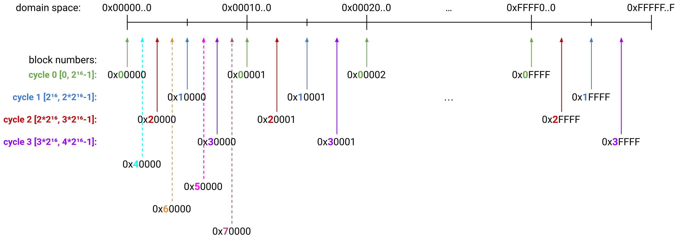
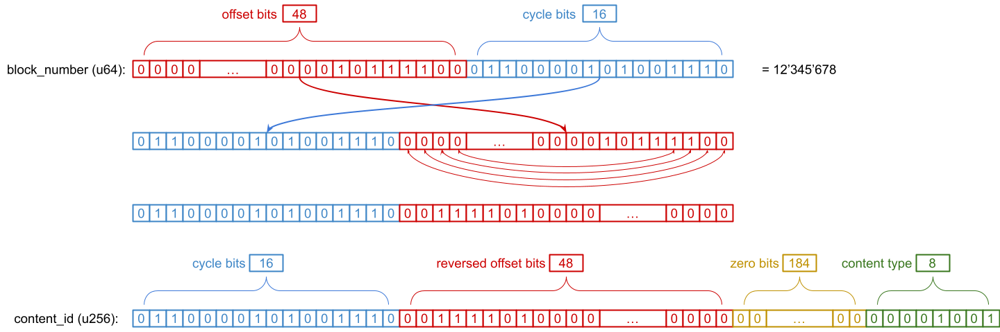

# Execution History Network

This document is the specification for the sub-protocol that supports on-demand availability of Ethereum execution chain history data.

## Overview

The Execution History Network is the subnetwork build on top of the [Portal Wire Protocol](../portal-wire-protocol.md).

It contains block bodies and receipts. Participants of this network are assumed to be the Execution Layer clients that store all historical headers locally. Other clients will need a way to obtain block header for a given block number in order to verify the content.

### Data

#### Types

- Block bodies
    - Transactions
    - Ommers
    - Withdrawals
- Receipts

#### Retrieval

The network supports the following mechanisms for data retrieval:

- Block body by block number
- Block receipts by block number

## Specification

### Distance Function

The History Network uses the stock `XOR` distance metric defined in the Portal wire protocol specification.

### Content id Derivation Function

The content keys (described later) use block number. The content id is calculated in the following way:

```python
CYCLE_BITS = 16
OFFSET_BITS = 256 - CYCLE_BITS # 240

def content_id(block_number: uint64, content_type: uint8):
    offset_bits, cycle_bits = divmod(block_number, 2 ** CYCLE_BITS)

    # reverse the offset bits
    offset_bits = int('{:0{width}b}'.format(offset_bits, width=OFFSET_BITS)[::-1], 2)

    return cycle_bits << OFFSET_BITS | offset_bits | content_type
```

Detailed explanation and visualization of the `content_id` function is provided in the [section below](#content-id-function).

### Wire protocol

The [Portal wire protocol](../portal-wire-protocol.md) is used as wire protocol for the History Network.

#### Protocol Identifier

As specified in the [Protocol identifiers](../portal-wire-protocol.md#protocol-identifiers) section of the Portal wire protocol, the `protocol` field in the `TALKREQ` message **MUST** contain the value of `0x5000`.

#### Message types

The History Network supports the following protocol messages:

- `Ping` - `Pong`
- `FindNodes` - `Nodes`
- `FindContent` - `FoundContent`
- `Offer` - `Accept`

#### Ping.payload & Pong.payload

The payload type of the first Ping/Pong message between nodes MUST be [Type 0: Client Info, Radius, and Capabilities Payload](../ping-extensions/extensions/type-0.md). Subsequent Ping/Pong message SHOULD use the latest payload type supported by both nodes.

List of currently supported payloads:

- [Type 1: Basic Radius Payload](../ping-extensions/extensions/type-1.md)

### Routing Table

The History Network uses the standard routing table structure from the Portal Wire Protocol.

### Node State

#### Data Radius

The History Network includes one additional piece of node state that should be tracked. Nodes must track the `data_radius` from the Ping and Pong messages for other nodes in the network. This value is a 256 bit integer and represents the data that a node is "interested" in. We define the following function to determine whether node in the network should be interested in a piece of content.

```python
interested(node, content) = distance(node.id, content.id) <= node.data_radius
```

A node is expected to maintain `radius` information for each node in its local node table.

A node's `radius` value may be fixed (in which case its disk usage will grow over time) or it may fluctuate as the contents of its local key-value store change.

A node should track their own radius value and provide this value in all Ping or Pong messages it sends to other nodes.

A node MUST use `radius` and [neighborhood gossip](../portal-wire-protocol.md#neighborhood-gossip) to gossip content.

### Data Types

The History Network contains block body and receipts content types. These types use `rlp` encoding of the underlying objects.

#### Block Body

The Block body content type contains block's transactions, ommers and withdrawals.

```python
selector        = 0x00
block_body_key  = Container(block_number: uint64)

content_key     = selector + SSZ.serialize(block_body_key)
content_value   = rlp.encode(block-body)
```

Note: The `block-body` refers to the type defined in the [devp2p spec](https://github.com/ethereum/devp2p/blob/bc76b9809a30e6dc5c8dcda996273f0f9bcf7108/caps/eth.md#block-encoding-and-validity), which is the collection of transactions, ommers and withdrawals.

The `content_type` parameter of the `content_id` function (defined [above](#content-id-derivation-function)) is the same as content key `selector`, i.e. `0x00`.

#### Receipts

The receipts content type contains block's receipts.

```python
selector        = 0x01
receipt_key     = Container(block_number: uint64)

receipts        = [receipt₁, receipt₂, ...]

content_key     = selector + SSZ.serialize(receipt_key)
content_value   = rlp.encode(receipts)
```

Note: The `receiptₙ` refers to the type defined in the [devp2p spec](https://github.com/ethereum/devp2p/blob/bc76b9809a30e6dc5c8dcda996273f0f9bcf7108/caps/eth.md#receipt-encoding-and-validity).

The `content_type` parameter of the `content_id` function (defined [above](#content-id-derivation-function)) is the same as content key `selector`, i.e. `0x01`.

## Appendix

### Content id function

The goal of the `content_id` function is to evenly spread content around domain space, while keeping consecutive blocks somewhat close to each other. This allows us to improve protocol in the future and add support for the range queries.

The blocks are split into cycles, where each cycle contains 65536 `(2^CYCLE_BITS)` consecutive blocks. Blocks from a single cycle are evenly distributed across entire domain space. Blocks from different cycles are offset in order to prevent multiple blocks mapping to the same `content_id` and to spread content more evenly.

Visualization of this idea is shown in the following [image](./../assets/range_content_id_idea.png):



We achieve this by manupulating bits of `block_number (uint64)`:

1. 16 least significant bits (`cycle bits`) and 48 most significant bits (`offset bits`) are swapped
2. Offsetting blocks from different cycles in a desired way is done by reversing the order of `offset_bits`
3. We append zeros to get a value from the domain space (`uint256`)
4. Finally, the last byte is set to the content type in order to have unique content id for different types (i.e. body vs. receipts)

The following [image](./../assets/range_content_id_derivation.png) shows this process for a block number `12'345'678` and receipts content type:



#### Interaction with distance function (`XOR`)

Because we use `XOR` as a distance function, it's possible that the radius doesn't cover continuous section of the domain space (resulting in "holes" in the stored range). This is not a big concern because:

- It is guaranteed that at least half of the radius will be continuous
  - This continuous section will include the `NodeId`
- If the radius is power or two, then the entire stored range is continuous
  - If we assume that clients use fixed radius, then they can enforce this
- Clients with dynamic radius can reduce the number of "holes" by minimizing the power of two that add up to the radius

#### Choosing `CYCLE_BITS`

The choice of the `CYCLE_BITS` has two tradeoffs that should be balanced:

- bigger value implies that each peer will store fewer longer sequences of consecutive blocks, rather than many shorter sequences
- bigger value also implies that if there is more demand for certain range of blocks (e.g. towards the head of the chain), the same nodes while take on the burder for longer to serve those requests

The value `CYCLE_BITS=16` is chosen because it simplifies function implementation in most languages (manipulation on byte vs. bit level), and because if we assume that each peer stores at least `1/256 (≈0.4%)` of all content, then they will also store sequences of at least `256` consecutive blocks (which feels like the a good balance).
