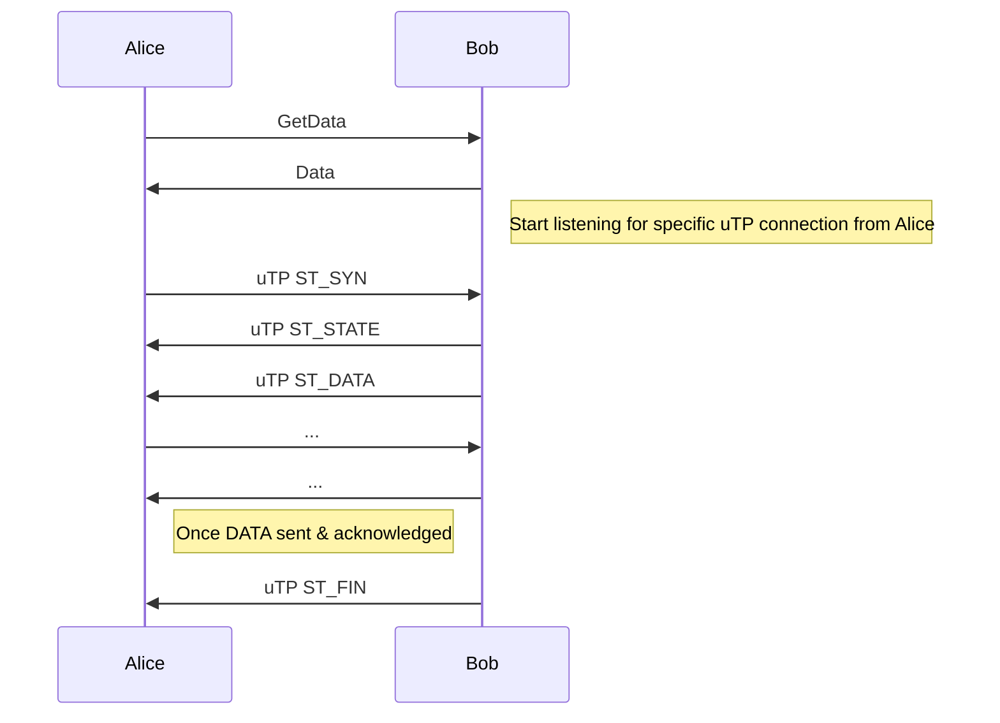
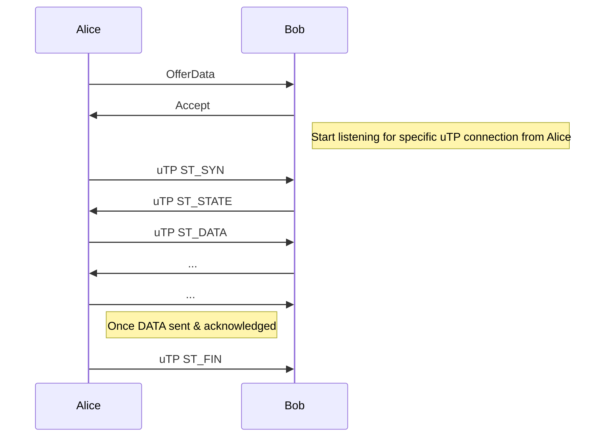

# uTP SubProtocol over Discovery v5

## Abstract

This document specifies an implementation of the [uTP](https://www.bittorrent.org/beps/bep_0029.html) streaming protocol which uses [Node Discovery Protocol v5](https://github.com/ethereum/devp2p/blob/6eddaf50298d551a83bcc242e7ce7024c6cc8590/discv5/discv5.md) as a transport instead of raw UDP packets.

## Motivation

The Discovery v5 protocol provides a simple and extensible UDP based protocol with robust encryption and resistance to deep packet inspection.  The use of UDP however imposes a tight limit on packet sizes. [Sub-protocols](https://github.com/ethereum/devp2p/blob/master/discv5/discv5-wire.md#talkreq-request-0x05) which wish to implement functionality that requires transmission of data that exceeds this packet size are forced to implement their own solutions for splitting these payloads across multiple UDP packets.  Packet loss makes this type of solution fragile.  A generic solution that can be reused across different Discovery v5 sub-protocols will improve the overall security and robustness of sub-protocols.

## Specification

The uTP over Discovery v5 protocol uses the byte string `utp` (`0x757470` in hex) as value for the protocol byte string in the `TALKREQ` message.

All uTP packets MUST be sent using the `TALKREQ` message.

This protocol MUST NOT use the `TALKRESP` message for sending uTP packets.

> Note: `TALKREQ` is part of a request-response mechanism and might cause Discovery v5 implementations
to invalidate peers when not receiving a `TALKRESP` response. This is an unresolved item in the specification.
Thus currently a `TALKRESP` message MAY be send as response on a `TALKREQ` message.
However, the response MUST be ignored by the uTP protocol.

The payload passed to the `request` field of the `TALKREQ` message is the uTP packet as specified in BEP29.

### BEP29

https://www.bittorrent.org/beps/bep_0029.html

The uTP protocol as specified in BEP29 defines the packet structure and logic for handling packets.

The main difference with BEP29 is that, instead of a raw UDP packet, the Discovery v5 `TALKREQ` message is used as transport.

Additionally, following deviations from the uTP specification or reference implementation are applied:
- The `connection_id` is passed out of band (i.e. in a Portal wire protocol message), instead of randomly generated by the uTP connection intiator: This is required for integration with the Portal wire protocol.
- To track incoming uTP streams, the IP address + port + Discovery v5 `NodeId` + `connection_id` is used, as opposed to IP address + port + `connection_id` in standard uTP.
- It is allowed to send `ST_DATA` without receiving `ST_DATA` first from the initiator of the uTP connection. This is not specified in BEP29, but rather a deviation from the [uTP reference implementation](https://github.com/bittorrent/libutp). It was added in the reference implementation to counter a reflective DDoS.
Relevant paper: https://www.usenix.org/system/files/conference/woot15/woot15-paper-adamsky.pdf.
However, when using Discovery v5 as a transport, the DDoS becomes no longer applicable because a full Discovery v5 handshake is required which will not work with a spoofed IP address.
- The uTP reference implementation deviates from the uTP specification on the initialization of the `ack_nr` when receiving the `ACK` of a `SYN` packet. The reference implementation [initializes](https://github.com/bittorrent/libutp/blob/master/utp_internal.cpp#L1874) this as `c.ack_nr = pkt.seq_nr - 1` while the specification indicates `c.ack_nr = pkt.seq_nr`. The uTP over Discovery v5 specifications follows the uTP reference implementation: `c.ack_nr = pkt.seq_nr - 1`.

## Example Usage

### Data Request
Suppose we have a sub-protocol with the following messages:

- `GetData` (request)
- `Data` (response)

A request is sent by Alice using the `GetData` message, containing an identifier
to the data. The size of the data to be transmitted exceeds the UDP packet size,
so the `Data` response sent by Bob will contain a randomly generated
`connection_id` instead.

Alice will then initiate a new uTP connection with Bob using this `connection_id`.

Bob, upon sending the `Data` message containing the `connection_id` will
*listen* for a new incoming connection from Alice over the `utp` sub-protocol.
When this new connection is opened, Alice can then read the bytes from the stream
until the connection closes.

The `connection_id` sent in the sub-protocol response message is the
`connection_id_send` value for the node sending the response, and thus the
`connection_id_recv` value for the initiator of the uTP connection.

A typical flow of messages:

The typical flow is that Bob sends the `ST_FIN` to terminate the uTP connection.
But Alice MAY also send a `ST_FIN` if Alice can conclude that it received all the
data, and there are situations where this may happen (e.g. lost `ST_FIN` packet).

### Data Offer
Suppose we have a sub-protocol with the following messages:

- `OfferData` (request)
- `Accept` (response)

An offer is sent by Alice using the `OfferData` message, containing an identifier
to the data. The `Accept` response sent by Bob will contain a randomly generated
`connection_id`.

Alice will then initiate a new uTP connection with Bob using this `connection_id`.

Bob, upon sending the `Accept` message containing the `connection_id` will
*listen* for a new incoming connection from Alice over the `utp` sub-protocol.
When this new connection is opened, Bob can then read the bytes from the stream
until the connection closes.

The `connection_id` sent in the response message is the `connection_id_send`
value for the node sending the response, and thus the `connection_id_recv` value
for the initiator of the uTP connection.

A typical message flow:

The typical flow is that Alice sends the `ST_FIN` to terminate the uTP connection.
But Bob MAY also send a `ST_FIN` if Bob can conclude that it received all the
data, and there are situations where this may happen (e.g. lost `ST_FIN` packet).
