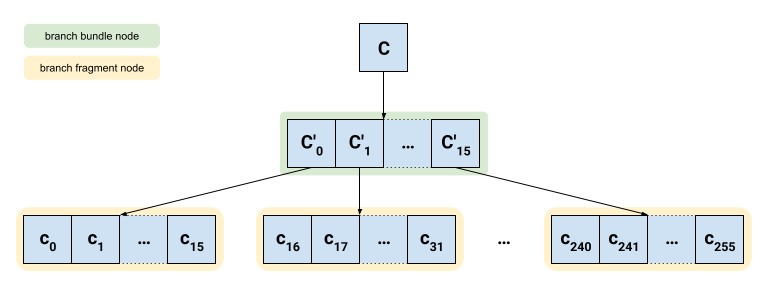
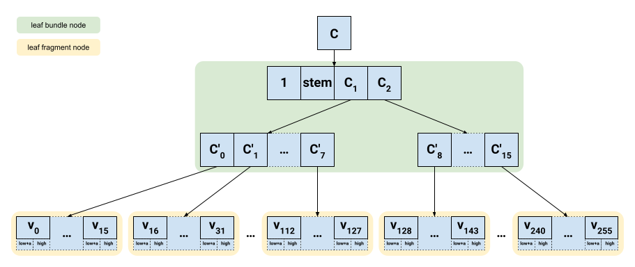

# Execution Verkle State Network

This document is the specification for the sub-protocol that supports on-demand availability of Verkle state data from the execution chain. Verkle trie is the upcoming structure for storing Ethereum state. See [EIP-6800](https://eips.ethereum.org/EIPS/eip-6800) for mode details.

> 🚧 THE SPEC IS IN A STATE OF FLUX AND SHOULD BE CONSIDERED UNSTABLE 🚧
>
> The prototype implementation of core types can be found [here](https://github.com/morph-dev/portal-verkle-primitives/tree/53193cdf2d57c3f5372a578a21c4d99395d6579d).

## Overview

The Verkle State Network subnetwork protocol is almost identical to the [State Network](./../state/state-network.md). The main difference is in the way that data is structured and encoded. Only differences will be provided below.

### Portal Network version of the Verkle Trie

The high level overview and reasoning, can be found here: [ethresear.ch/t/portal-network-verkle/19339](https://ethresear.ch/t/portal-network-verkle/19339).

Portal Network stores every trie node that ever existed. For optimization reasons, each trie node is split into 2-layer mini trie and each node from the mini-trie is stored separately in the network. The exact encoding and the content key is derived differently and is specified below.

To represent the trie node, the Verkle Trie uses Pedersen Commitment, which is calculated using following formula:

$$C = Commit(a_0, a_1, ..., a_{255}) = a_0B_0 + a_1B_1 + ... + a_{255}B_{255}$$

where:

- $B_i$ is basis of the Pedersen commitment
  - already fixed Elliptic curve points on Banderwagon (a prime order subgroup over [Bandersnatch](https://ethresear.ch/t/introducing-bandersnatch-a-fast-elliptic-curve-built-over-the-bls12-381-scalar-field/9957)) curve.
- $a_i$ are values we are committing to
  - value from elliptic curve's scalar field $F_r$ (maximum value is less than $2^{253}$)
- $C$ is the commitment of $a_i$ values, which on its own is a point on the elliptic curve
  - in order to commit to another commitment, we map commitment $C$ to the scalar field $F_r$ and we call that **Pedersen Hash** or **hash commitment**
  - these two values are frequently used interchangeably, but they are not one-to-one mapping
  - in this document, we will use $C$ to indicate commitment expressed as elliptic point, and $c$ when it's mapped to scalar field (hash commitment)

#### Trie Node

The Verkle trie has 2 types of nodes:

- branch (inner) node: up to 256 children nodes (either branch or leaf)
- leaf (extension) node: up to 256 values (32 bytes each)

##### Branch (Inner) node

The branch node of the Verkle trie stores up to 256 values, each of which is a hash commitment of a child trie node.

$$C = c_0B_0 + c_1B_1 + ... + c_{255}B_{255}$$

For optimization reasons, Portal Network splits branch node into 2-layer mini network in the following way:



Each of the `branch-fragment` node stores hash commitments of 16 children nodes. The commitment of those 16 children represents that fragment node and is stored inside `branch-bundle` node.

$$
\begin{align*}
C^\prime_0 &= c_0B_0 + c_1B_1 +…+ c_{15}B_{15} \\
C^\prime_1 &= c_{16}B_{16} + c_{17}B_{17} +…+ c_{31}B_{31} \\
&… \\
C^\prime_{15} &= c_{240}B_{240} + c_{241}B_{241} +…+ c_{255}B_{255} \\
\end{align*}
$$

The commitment of the `branch-bundle` node ($C$) is calculated as a sum 16 `branch-fragment` node commitments ($C^\prime_i$).

$$C = C^\prime_0 + C^\prime_1 +...+ C^\prime_{15}$$

##### Leaf (extension) node

The leaf node of the Verkle trie stores up to 256 values, each 32 bytes long. Because value (32 bytes) doesn't fit into scalar field, commitment of the leaf node ($C$) is calculated in the following way.

$$C = Commit(marker, stem, C_1, C_2)$$

$$
\begin{align*}
C_1 &= Commit(v_0^{low+access}, v_0^{high}, v_1^{low+access}, v_1^{high},  ... , v_{127}^{low+access}, v_{127}^{high}) \\
C_2 &= Commit(v_{128}^{low+access}, v_{128}^{high}, v_{129}^{low+access}, v_{129}^{high},  ... , v_{255}^{low+access}, v_{255}^{high}) \\
\end{align*}
$$

where:

- $marker$ - currently only value $1$ is used
- $stem$ - the path from the root of the trie (31 bytes)
- $v_i^{low+access}$ - the lower 16 bytes of the value $v_i$ plus $2^{128}$ if value is modified
  - note that if value is not modified, it will be equal to $0$
- $v_i^{high}$ - the higher 16 bytes of the value $v_i$

For optimization reasons, Portal Network splits leaf node into 2-layer mini network in the following way:



Each of the `leaf-fragment` nodes stores up to 16 values (32 bytes each).

The commitment of those 16 values ($C^\prime_i$) represents that fragment node and is stored inside `leaf-bundle` node.

$$
\begin{align*}
C^\prime_0 &= v_0^{low+access}B_0 + v_0^{high}B_1 + v_1^{low+access}B_2 + v_1^{high}B_3 +…+ v_{15}^{low,access}B_{30} + v_{15}^{high}B_{31} \\
C^\prime_1 &= v_{16}^{low+access}B_{32} + v_{16}^{high}B_{33} + v_{17}^{low+access}B_{34} + v_{17}^{high}B_{35} +…+ v_{31}^{low,access}B_{62} + v_{31}^{high}B_{63} \\
&… \\
C^\prime_7 &= v_{112}^{low+access}B_{224} + v_{112}^{high}B_{225} + v_{113}^{low+access}B_{226} + v_{113}^{high}B_{227} +…+ v_{127}^{low,access}B_{254} + v_{127}^{high}B_{255} \\
\\
C^\prime_8 &= v_{128}^{low+access}B_{0} + v_{128}^{high}B_{1} + v_{129}^{low+access}B_{3} + v_{129}^{high}B_{4} +…+ v_{143}^{low,access}B_{30} + v_{143}^{high}B_{31} \\
&… \\
C^\prime_{15} &= v_{240}^{low+access}B_{224} + v_{240}^{high}B_{225} + v_{241}^{low+access}B_{256} + v_{241}^{high}B_{227} +…+ v_{255}^{low,access}B_{254} + v_{255}^{high}B_{255} \\
\end{align*}
$$

The commitment of the `leaf-bundle` node ($C$) is calculated in the following way:

$$
\begin{align*}
C_1 &= C^\prime_0 + C^\prime_1 + … + C^\prime_7 \\
C_2 &= C^\prime_8 + C^\prime_9 + … + C^\prime_{15}
\end{align*}
$$

$$
C = marker \cdot B_0 + stem \cdot B_1 + c_1B_2 + c_2B_3
$$

## Specification

### Protocol Identifier

As specified in the [Protocol identifiers](./../portal-wire-protocol.md#protocol-identifiers) section of the Portal wire protocol, the `protocol` field in the `TALKREQ` message **MUST** contain the value of `0x500E`.

### Helper Data Types

#### Stem

The Stem represents the first 31 bytes of the Verkle Trie key.

```text
Stem := Bytes31
```

#### Children

All nodes store up to 16 children. The `type` of children can be different, but in all cases they have fixed encoding length (32 bytes).

```text
Children[type]  := SparseVector[type; 16]
```

The encoding of the `SparseVector` is the following:

- 2 bytes representing the bitmap of the present children (little-endian encoding)
- encoding of each present child
  - note that each child has fixed length encoding (32 bytes)

Note that the count of set bits inside `bitmap` field MUST be equal to the number of encoded `children`. The order of the children is from the lowest to the highest set bit.

#### Commitment

Both elliptic curve point (commitment) and scalar field value (hash commitment) can be encoded using 32 bytes. We will define them separately in order to be explicit.

```text
EllipticCurvePoint := Bytes32
ScalarFieldValue   := Bytes32
```

#### Trie Proof

Using IPA and Multiproof, the same proving scheme that Verkle uses, we can prove that any node or value is included in a trie in a memory efficient way.

Additional data is usually needed in order to verify the proof. Such data depends on the context and will be extractable from other fields within content key/value.

```text
MultiProof := Container(
                  ipa_proof: IpaProof,
                  g_commitment: EllipticCurvePoint,
              )
IpaProof   := Container(
                  cl: Vector[EllipticCurvePoint; 8],
                  cr: Vector[EllipticCurvePoint; 8],
                  final_evaluation: ScalarFieldValue,
              )
```

#### Trie path commitments

Verification of proofs require trie path from the root, along with commitments of branch nodes along the way.

For branch nodes, we combine node commitment and child index.

```text
PathWithCommitments      := List(CommitmentChildIndexPair; 30)
CommitmentChildIndexPair := Container(
                                commitment: EllipticCurvePoint,
                                child_index: u8,
                            )
```

For leaf nodes, we only need commitments along the trie path. The path itself can be derive from the stem, that is provided separately.

```text
PathCommitments          := List(EllipticCurvePoint, 31)
```

#### Bundle Commitment Proof

| **⚠️ This section needs more research. ⚠️**

In order to prevent bad actors from creating false data for the `bundle` nodes of the mini tries, we have to create and include proof that fragment commitments are correct.

The simplest approach is to use `MultiProof`, but it might not be the most efficient approach and more research is needed in this regard.

```text
BundleProof := MultiProof
```

To verify the proof, one has to create openings for each fragment commitments at indices that **don't** correspond to that fragment and prove that values are `0`.

#### Trie node

Each trie node has a different type and different proof.

```text
BranchBundleNode             := Container(
                                    fragments: Children[EllipticCurvePoint],
                                    proof: BundleProof,
                                )
BranchBundleNodeWithProof    := Container(
                                    node: BranchBundleNode,
                                    block_hash: Bytes32,
                                    trie_path: PathWithCommitments,
                                    multiproof: MultiProof,
                                )

BranchFragmentNode           := Container(
                                    fragment_index: uint8,
                                    children: Children[EllipticCurvePoint],
                                )
BranchFragmentNodeWithProof  := Container(
                                    node: BranchFragmentNode,
                                    block_hash: Bytes32,
                                    bundle_commitment: EllipticCurvePoint,
                                    trie_path: PathWithCommitments,
                                    multiproof: MultiProof,
                                )                               

LeafBundleNode               := Container(
                                    marker: uint64,
                                    stem: Stem,
                                    fragments: Children[EllipticCurvePoint],
                                    proof: BundleProof,
                                )
LeafBundleNodeWithProof      := Container(
                                    node: LeafBundleNode,
                                    block_hash: Bytes32,
                                    trie_path: PathCommitments,
                                    multiproof: MultiProof,
                                )

LeafFragmentNode             := Container(
                                    fragment_index: uint8,
                                    values: Children[Bytes32],
                                )
LeafFragmentNodeWithProof    := Container(
                                    node: LeafFragmentNode,
                                    block_hash: Bytes32,
                                    marker: uint64,
                                    bundle_commitment: EllipticCurvePoint,
                                    suffix_commitment: EllipticCurvePoint,
                                    trie_path: PathCommitments,
                                    multiproof: MultiProof,
                                )
```

### Content types

#### Content keys

When doing lookup for bundle node, we don't know if we should expect branch-bundle or leaf-bundle node. For this reason, they use the same content key type.

The branch-fragment key has to be different from the branch-bundle key, because they can have the same commitment (in case other fragments from that bundle are zero).

The leaf-fragment key should include the `stem`, in order to avoid hot-spots. Others keys don't have to worry about hot-spots because they are build on top of leaf-bundle nodes that already includes `stem` in its commitment (effectively guaranteeing the uniqueness).

```text
bundle_node_key              := EllipticCurvePoint
bundle_content_key           := 0x30 + SSZ.serialize(bundle_node_key)

branch_fragment_node_key     := EllipticCurvePoint
branch_fragment_content_key  := 0x31 + SSZ.serialize(branch_fragment_node_key)

leaf_fragment_node_key       := Container(stem: Stem, commitment: EllipticCurvePoint)
leaf_fragment_content_key    := 0x32 + SSZ.serialize(leaf_fragment_node_key)
```

#### Content values

```text
VerkleNode           := Union(
                            BranchBundleNode,
                            BranchFragmentNode,
                            LeafBundleNode,
                            LeafFragmentNode,
                        )
VerkleNodeWithProof  := Union(
                            BranchBundleNodeWithProof,
                            BranchFragmentNodeWithProof,
                            LeafBundleNodeWithProof,
                            LeafFragmentNodeWithProof,
                        )

content_value := Union(VerkleNode, VerkleNodeWithProof)
```

The FINDCONTENT/FOUNDCONTENT payloads have to be verifiable that they match the commitment that identifies them, while the OFFER/ACCEPT payloads need to be provable by their recipients. For this reason, the FINDCONTENT/FOUNDCONTENT payloads MUST use `VerkleNode` variant, while the OFFER/ACCEPT payloads MUST use `VerkleNodeWithProof` variant.

The content-value has to correspond to the content-key.

## Gossip

As each block, the bridge is responsible for detecting and gossiping all created and updated trie nodes separately. Bridge should first compute all content-ids that should be gossiped, and it should gossip them based on their distance to its own node-id, from closest to farthest.
